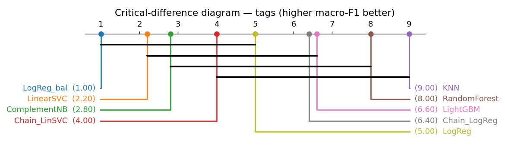
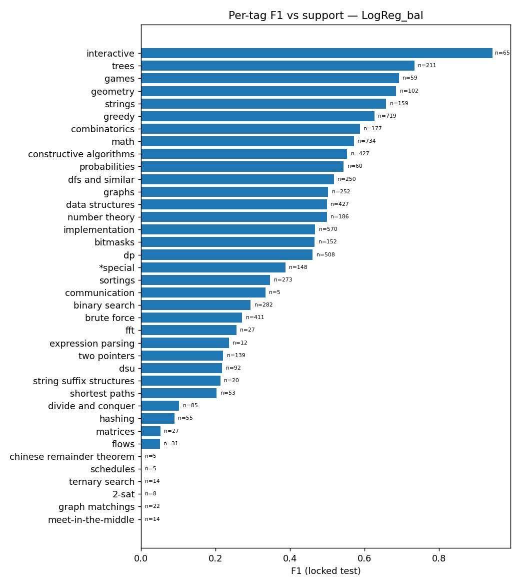

# Classification Findings — Codeforces Tag Prediction

**Task:** multi-label prediction of 38 official algorithm tags (`tags_norm`) from statement text + metadata.
**Protocol:** locked 80/20 hold-out via `GroupShuffleSplit` on `cv_group`; model selection by
`GroupKFold(5)` inside train; vectorizers/binarizer/thresholds fit on train folds only; seed 42.
Primary metrics **macro-F1 & micro-F1**. Source artifacts: `experiments/results/`, regenerate with
`python experiments/src/run_experiment.py`. See also the consolidated [PROJECT_REPORT](../PROJECT_REPORT.md).

## 1. Leaderboard (CV mean ± std, ranked by CV micro-F1; + locked test)

| Model | Family | micro-F1 | macro-F1 | Prec μ | Recall μ | Hamming | Jaccard | micro-F1 (locked) | macro-F1 (locked) |
|-------|--------|---------:|---------:|-------:|---------:|--------:|--------:|------------------:|------------------:|
| **LogReg_bal** | Linear | **0.489** | **0.351** | 0.459 | 0.523 | 0.084 | 0.347 | **0.484** | **0.349** |
| ComplementNB | NaiveBayes | 0.453 | 0.269 | 0.487 | 0.423 | 0.078 | 0.319 | 0.447 | 0.262 |
| Chain_LinSVC | Chain | 0.417 | 0.261 | 0.584 | 0.324 | 0.069 | 0.299 | 0.416 | 0.257 |
| LinearSVC | Linear | 0.416 | 0.272 | 0.541 | 0.338 | 0.073 | 0.291 | 0.412 | 0.262 |
| LogReg | Linear | 0.404 | 0.250 | 0.614 | 0.301 | 0.068 | 0.282 | 0.401 | 0.241 |
| Chain_LogReg | Chain | 0.390 | 0.229 | 0.626 | 0.283 | 0.068 | 0.279 | 0.390 | 0.223 |
| LightGBM | Boosting | 0.363 | 0.228 | 0.659 | 0.250 | 0.067 | 0.251 | 0.350 | 0.216 |
| Baseline (top-3) | Baseline | 0.308 | 0.037 | 0.303 | 0.313 | 0.108 | 0.208 | 0.295 | 0.036 |
| RandomForest | Trees | 0.136 | 0.074 | 0.769 | 0.075 | 0.073 | 0.085 | 0.139 | 0.074 |
| KNN | Instance | 0.129 | 0.045 | 0.527 | 0.073 | 0.076 | 0.080 | 0.128 | 0.043 |

**Champion: `LogReg_bal`** (Logistic Regression, `class_weight='balanced'`, TF-IDF word 1–2grams) —
locked-test micro-F1 **0.484**, macro-F1 **0.349**. Class balancing lifts recall and macro-F1 well
above plain LogReg/LinearSVC, which chase precision.

## 2. Statistical significance (§6.3)

Friedman χ² = 39.47, p = 4.03e-06. LogReg_bal has the best average rank (1.0).
Paired Wilcoxon top-2, LogReg_bal vs LinearSVC: p = 0.0625.

Ranking disagreement: on **precision-micro**, RandomForest tops (0.77) by predicting almost nothing —
a reminder to read precision alongside recall.

## 3. Imbalance & per-label thresholds (§5.4) — class weighting vs. thresholds

Per-label threshold tuning was applied **to the champion itself** (LogReg_bal, probability scores,
thresholds tuned on a grouped validation split within train, evaluated once on the locked test):

| LogReg_bal (locked test) | micro-F1 | macro-F1 | precision μ | recall μ |
|--------------------------|---------:|---------:|------------:|---------:|
| base (0.5 threshold) — **headline** | **0.4837** | **0.3493** | 0.4545 | 0.5169 |
| per-label tuned | 0.3964 | 0.3515 | 0.2976 | 0.5933 |

- **Key finding: class weighting and threshold tuning are *substitutes*, not complements.** On the
  already-balanced champion, tuned thresholds add only +0.002 macro-F1 while costing 0.09 micro-F1
  (precision collapses). The dramatic lift seen on the *unbalanced* LinearSVC (macro-F1
  0.248 → 0.341, recall 0.307 → 0.585 — §5 strategy table) shows both mechanisms capture the same
  recall-for-precision trade; the champion gets it from `class_weight='balanced'` directly.
  **The headline number therefore stays the base champion: micro-F1 0.4837 / macro-F1 0.3493.**
- **Rare-tag floor** (≥15 train examples, 36 of 38 tags): champion macro-F1 **0.3595** (tuned
  0.3667) vs 0.3493 over all 38 — the two unlearnable tail tags cost ~0.01 macro.
- **`*special`** meta-tag (n=389 train): champion F1 0.3871 (tuning does not help: 0.3738).
- **Tail policy (documented decision):** report **all 38 tags as the primary, honest number**;
  report the ≥15-example floor alongside; report `*special` separately (it is a CF meta-marker,
  not an algorithmic tag). No tags are merged or dropped — the unlearnable tail (`schedules`,
  `chinese remainder theorem`, …) is disclosed as a ceiling instead of being hidden.
- **Iterative-stratification sanity** (row-level, non-grouped — allows duplicate leakage, reference
  only): micro-F1 0.451, macro-F1 0.314. Grouped split remains the honest protocol.

## 4. Per-tag F1 (champion, locked test)

Strongest tags — full table [`per_tag_f1.csv`](../../experiments/results/per_tag_f1.csv):

| Tag | F1 | Precision | Recall | Support |
|-----|---:|----------:|-------:|--------:|
| interactive | 0.944 | 0.983 | 0.908 | 65 |
| trees | 0.734 | 0.711 | 0.758 | 211 |
| games | 0.692 | 0.634 | 0.763 | 59 |
| geometry | 0.684 | 0.626 | 0.755 | 102 |
| strings | 0.658 | 0.559 | 0.799 | 159 |
| greedy | 0.626 | 0.566 | 0.701 | 719 |
| combinatorics | 0.588 | 0.540 | 0.644 | 177 |
| math | 0.571 | 0.546 | 0.599 | 734 |
| constructive algorithms | 0.553 | 0.507 | 0.609 | 427 |
| probabilities | 0.544 | 0.523 | 0.567 | 60 |

**Unrecovered (F1 = 0):** `graph matchings`, `meet-in-the-middle`, `ternary search`, `2-sat`,
`chinese remainder theorem`, `schedules` — the long-tail class-imbalance ceiling. `interactive` is
near-trivial (93% of such statements literally contain "interact").

## 5. Ablations (§8)

**TF-IDF variant (LinearSVC):** word 1–2grams best (micro-F1 0.416 / macro-F1 0.272) >
char 3–5 (0.395 / 0.269) > word-1 (0.394 / 0.264).

**Tag strategy (LinearSVC base):**

| Strategy | micro-F1 | macro-F1 | recall-micro |
|----------|---------:|---------:|-------------:|
| Binary-Relevance | 0.416 | 0.272 | 0.338 |
| Classifier-Chain | 0.417 | 0.261 | 0.324 |
| **Per-label-threshold** | **0.433** | **0.349** | **0.591** |

> **Key insight:** modeling label dependencies (chains) barely moves the needle, but **per-label
> thresholding is decisive for unbalanced models** — macro-F1 0.272 → 0.349 and recall
> 0.338 → 0.591 — reaching roughly what `class_weight='balanced'` achieves directly (see §3).

**Keyword flags + query_count (P3):** 15 deterministic algorithm-keyword regex flags + log1p
query-count appended to the TF-IDF (`tfidf+kw`), champion LogReg_bal on identical folds:

| Features | micro-F1 | macro-F1 |
|----------|---------:|---------:|
| tfidf_word_12 | 0.4886 | 0.3507 |
| tfidf + keywords | 0.4887 | **0.3571** |

A modest **+0.006 macro-F1** (micro unchanged) — the TF-IDF already encodes most keyword signal;
the flags mainly help mid-tail tags. Not adopted into the headline champion (marginal), but recorded
in `ablation_keyword_flags.csv`.

## 6. Error analysis & interpretability

**Most-confused tag pairs** (qualitative view — when the true tag is missed, what gets predicted
instead; full list in [`tags_confusion_pairs.csv`](../../experiments/results/tags_confusion_pairs.csv)):

| True tag missed | Predicted instead | Count |
|-----------------|-------------------|------:|
| math | implementation | 72 |
| brute force | greedy | 65 |
| dp | greedy | 61 |
| math | dp | 59 |
| brute force | implementation | 59 |
| implementation | math | 58 |

The confusions concentrate inside the "generic technique" head (`math` / `implementation` /
`greedy` / `brute force` / `dp`) — semantically adjacent labels that even human taggers apply
inconsistently, so this is partly label noise rather than pure model error.

- Never-predicted tags (2): `chinese remainder theorem`, `schedules` —
  [`tags_never_predicted.json`](../../experiments/results/tags_never_predicted.json).
- Top tokens per tag: [`tags_top_tokens_per_tag.csv`](../../experiments/results/tags_top_tokens_per_tag.csv).

## 7. Takeaways

1. **LogReg_bal is the champion** (locked micro-F1 0.4837 / macro-F1 0.3493) — class balancing beats
   precision-chasing linear models.
2. **Class weighting and per-label thresholds are substitutes** — thresholds transform an unbalanced
   LinearSVC (macro-F1 0.27 → 0.35) but add nothing on top of the balanced champion (§3). The
   headline stays the base champion.
3. Word 1–2gram TF-IDF is the best representation; classifier chains add little; keyword flags add
   a modest +0.006 macro-F1 (§5).
4. Head tags are well-modeled; the rare-tag tail is the hard ceiling. Policy: all-38 primary,
   ≥15-example floor (macro-F1 0.3595) reported alongside, `*special` reported separately (§3).
