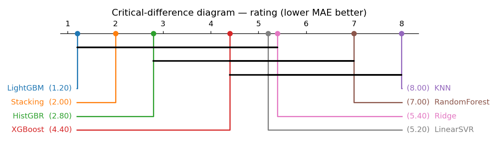
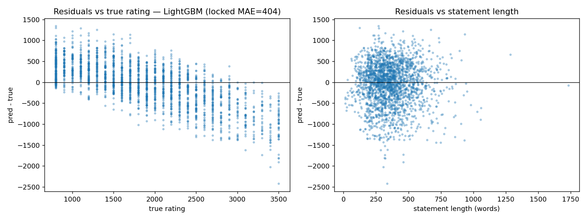
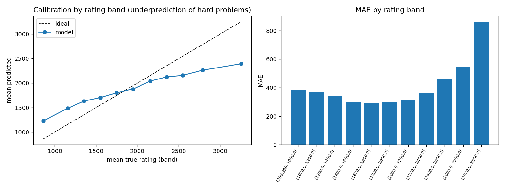
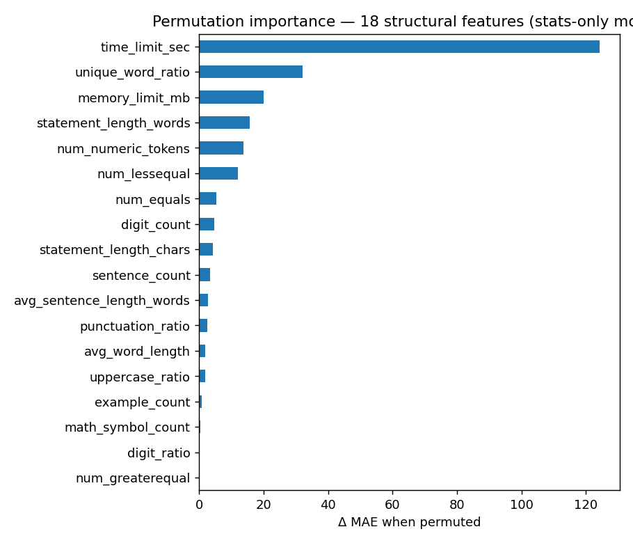

# Regression Findings — Codeforces Rating Prediction

**Task:** predict a problem's `rating` (800–3500) from its statement text + metadata.
**Protocol:** locked 80/20 hold-out via `GroupShuffleSplit` on `cv_group`; model selection by
`GroupKFold(5)` inside train; every vectorizer/scaler/embedding fit on train folds only; seed 42.
Primary metric **MAE**. Source artifacts: `experiments/results/` (raw CSV/JSON), regenerate with
`python experiments/src/run_experiment.py`. See also the consolidated [PROJECT_REPORT](../PROJECT_REPORT.md).

## 1. Leaderboard (CV mean ± std, ranked by CV MAE; + locked test)

| Model | Family | Features | MAE | RMSE | R² | Spearman | ±100 | ±200 | MAE (locked) | R² (locked) |
|-------|--------|----------|----:|-----:|---:|---------:|-----:|-----:|-------------:|------------:|
| **LightGBM** | Boosting | unified | **405.8 ± 8.5** | 517.8 | 0.500 | 0.717 | 0.167 | 0.318 | **404.0** | 0.496 |
| Stacking | Ensemble | lsa+stats | 412.4 ± 12.3 | 525.9 | 0.484 | 0.710 | 0.154 | 0.304 | 411.6 | 0.477 |
| HistGBR | Boosting | lsa+stats | 419.7 ± 9.5 | 531.5 | 0.473 | 0.695 | 0.152 | 0.299 | 414.0 | 0.477 |
| XGBoost | Boosting | lsa+stats | 422.8 ± 9.4 | 536.1 | 0.464 | 0.691 | 0.153 | 0.296 | 423.3 | 0.458 |
| LinearSVR | Kernel | lsa+stats | 427.8 ± 9.6 | 550.3 | 0.435 | 0.699 | 0.155 | 0.302 | 422.8 | 0.436 |
| Ridge | Linear | tfidf+stats | 430.0 ± 9.2 | 543.3 | 0.448 | 0.698 | 0.147 | 0.283 | 424.4 | 0.457 |
| RandomForest | Trees | lsa+stats | 473.4 ± 6.1 | 578.0 | 0.377 | 0.677 | 0.119 | 0.241 | 466.7 | 0.383 |
| KNN | Instance | lsa+stats | 526.8 ± 6.4 | 646.5 | 0.221 | 0.508 | 0.109 | 0.218 | 529.4 | 0.204 |
| Dummy (mean) | Baseline | stats | 614.0 ± 7.6 | 732.6 | −0.00 | 0.000 | 0.093 | 0.184 | 608.8 | −0.00 |

**Champion: `LightGBM` (unified features)** — locked-test MAE **404.0**, R² **0.50**, cutting the
mean-baseline MAE (≈609) by a third and explaining ~50% of rating variance from statement + metadata alone.

## 2. Statistical significance (§6.3)

Friedman χ² = 33.20, p = 2.43e-05 across the roster. LightGBM has the best average rank (1.2).

No ranking disagreements across metrics.

**Ensembling verdict (P2):** Stacking (Ridge+RF+HistGBR → Ridge meta) is the runner-up but does
**not** significantly beat LightGBM — paired Wilcoxon on the 5 shared folds p = 0.125, and LightGBM
wins on mean CV MAE (405.8 vs 412.4), locked MAE (404.0 vs 411.6), and average rank (1.2 vs 2.0) —
at ~7× Stacking's training cost. **LightGBM stays the champion; the ensemble is not adopted.**

## 3. Ablations (§8)

**Feature-family lift** — LightGBM vs Ridge across feature sets (CV MAE):

| Features | Ridge | LightGBM |
|----------|------:|---------:|
| stats | 491.7 | 465.6 |
| tfidf_word_12 | 474.5 | 456.9 |
| **tfidf+stats** | 430.0 | **404.4** |
| lsa+stats | 428.1 | 421.7 |
| unified | 430.7 | 405.8 |

> **Key insight:** `tfidf+stats` (404.4) essentially ties `unified` (405.8) — **the Word2Vec block adds
> ~nothing to rating**; TF-IDF + structural stats carry the signal. Candidate simplification.

**TF-IDF variant (Ridge, MAE):** word 1–2grams **474.5** < char 3–5 (495.1) < word-1 (499.4).

**Word2Vec probe (fold-0 MAE, weak alone, 508–537):** cbow ≥ skip-gram; mean pooling ≥ tf-idf-weighted;
best = size 300, cbow, mean (508.5). Confirms w2v underperforms TF-IDF here.

## 4. Ordinal & quantile framing (§4.4)

Treating rating as 11 difficulty bands: a direct ordinal classifier gets exact-band **0.251** /
within-one-band **0.474**; the LightGBM regressor bucketed gets exact **0.190** / within-one **0.494**.
Regression wins on the softer within-one-band metric; the ordinal classifier's exact-band edge comes
from committing to a band rather than predicting a continuous value near a boundary.

**Quantile-loss note:** the champion already *is* a quantile model — it trains with LightGBM's
`objective="regression_l1"`, which minimizes absolute error, i.e. the **median (quantile-0.5) loss**.
A separate quantile experiment would only differ for non-median quantiles (prediction intervals),
which are out of scope for a point-estimate leaderboard.

## 5. Error analysis & interpretability

### 5.1 Regression-to-the-mean bias, quantified (P2)

The champion systematically **compresses the difficulty scale toward the center** (locked test,
from [`rating_calibration.csv`](../../experiments/results/rating_calibration.csv)):

| True band | n | mean true | mean pred | bias | band MAE |
|-----------|--:|----------:|----------:|-----:|---------:|
| 800–1000 | 359 | 860 | 1226 | **+366** (over) | 383 |
| 1600–1800 | 199 | 1748 | 1799 | +51 (calibrated) | 289 |
| 2400–2600 | 141 | 2545 | 2156 | −389 (under) | 456 |
| 2600–2900 | 163 | 2788 | 2261 | **−526** (under) | 544 |
| 2900–3500 | 184 | 3256 | 2394 | **−862** (under) | 862 |

The model is well-calibrated only in the 1600–2000 core; the hardest band is under-predicted by
~860 points on average — the text of a 3500-rated problem simply doesn't announce its difficulty,
which lives in the solution, not the statement. Any downstream use should treat predictions ≥2400
as "hard, floor estimate".

### 5.2 Qualitative examples (worst locked-test misses)

| Problem | True | Pred | Error | Why plausible |
|---------|-----:|-----:|------:|---------------|
| 1766/A "Extremely Round" | 800 | 2096 | +1296 | Number-theory vocabulary reads "hard"; the trick is trivial. |
| 1769/A (Russian statement) | 800 | 2141 | +1341 | Cyrillic text → sparse TF-IDF support. |
| 1746/G "Olympiad Training" | 3500 | 1076 | −2424 | Short, plain statement; all difficulty is in the solution. |
| 1693/F "I Might Be Wrong" | 3400 | 1378 | −2022 | Same pattern: innocuous text, brutal problem. |

Full list: [`rating_worst_predictions.csv`](../../experiments/results/rating_worst_predictions.csv).

### 5.3 Feature importance & tokens

- Structural importances: [`rating_stats_importance.csv`](../../experiments/results/rating_stats_importance.csv).
- Top predictive tokens: [`rating_top_tokens.csv`](../../experiments/results/rating_top_tokens.csv).

## 6. Takeaways

1. **LightGBM is the clear champion** (MAE ≈ 404), statistically ahead of the field; Stacking does
   not significantly improve on it (Wilcoxon p = 0.125) and is not adopted (§2).
2. **Word2Vec is dead weight** for rating — `tfidf+stats` matches `unified`; consider dropping it.
3. Word 1–2gram TF-IDF is the best text representation; char-grams and unigrams trail.
4. ~404 MAE on the 800–3500 scale is a non-leaky ceiling for these features (`solvedCount` excluded
   as leakage), with a quantified regression-to-the-mean bias: hardest band under-predicted by
   ~860 points on average (§5.1).
